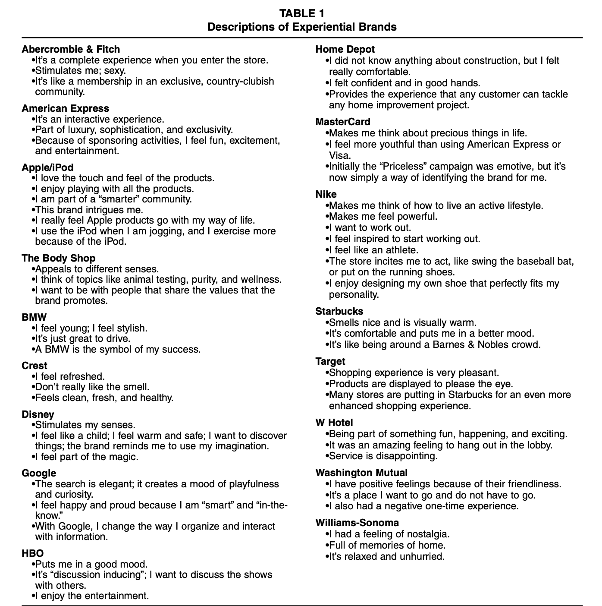
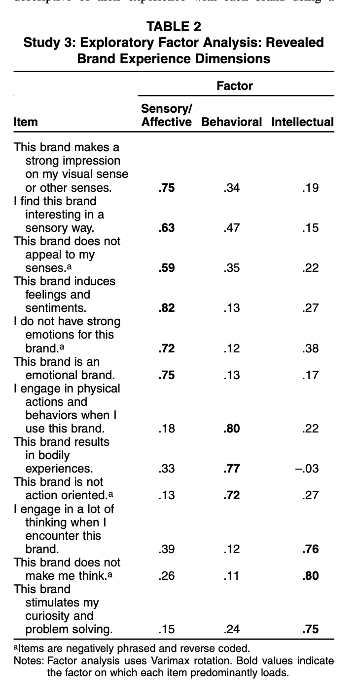

- **Tags:** #permanent-notes 
- **Relevant Notes**
	- [ux-design](moc/ux-design.md)

## Notes
### What is branding experience
- Brand experience encompasses subjective consumer responses in the form of sensations, feelings, thoughts, and reactions responses in response to brand-related stimuli. They are part of a brand's design by identity, packaging, communications, and environments.
### Importance
- Good brand experience connects more with the audience in a way that it sticks with them more and facilitates deeper connections. This highlights a brand's selling point and ultimately attracts a customer and makes them stay.
### Brand-related stimuli
#### Dimensions
1. Sensory
2. Affective
3. Intellectual
4. Behavioral
#### Elements
1. Colors
2. Shapes
3. Typefaces
4. Designs
5. Slogans
6. Mascots
7. Brand characters
### How-to
#### Elements that create a successful brand experience
- Brand design
- Brand voice
- User experience
- Brand image, and
- Customer support
#### Steps
1. Align with the company's purpose as these will set the USP and tone of the brand.
2. Use storytelling. Tell your brand's story, who you are, your mission, etc. How will these relate to the people?
3. Practice consistency. Make sure the "brand image" is aligned across platforms.
4. Engage the senses.
5. Participate in events and popular culture.
6. Be personal and unique.

## Highlights
- [How to create an awesome brand experience - 99designs](https://99designs.com/blog/logo-branding/brand-experience/)[^1]
	- What is brand experience
		- “Brand” is the company, as perceived by the world. Your brand defines why you are in existence, your raison d’être. “Experience” on the other hand describes how you live and grow. Therefore, brand experience quite literally describes ==how the brand is experienced by potential and existing customers before, during and after any and all interactions, throughout its existence.==
		- The most well known brands that exist today place strong emphasis on brand experience. ==Apple is an obvious example. From the retail store, to the packaging, to the interface, all the points in which we interact with Apple are curated and harmonious with the overall brand experience.==
	- Elements that create a successful brand experience
		- Brand design
		- Brand voice
		- User experience
		- Brand image, and
		- Customer support
	- How-to
		- Discover your purpose
			- Defining who you are will set the tone of the type of experience you want to create. In an oversaturated market, products that are connected to a bigger purpose can stand out from the crowd—the purpose often has more value than the product itself. What is your brand’s higher purpose?
		- Focus on storytelling
			- What’s your brand’s story?  How did you come to be? How are you improving lives?
		- Be consistent
		- Find opportunities for engagement
		- Put experiences over sales
- Brand Experience:What Is It? How Is It Measured? Does It Affect Loyalty?[^2]
	- Brand experience is conceptualized as ==sensations, feelings, cognitions, and behavioral responses evoked by brand-related stimuli== that are part of a brand’s design and identity, packaging, communications, and environments.
	- However, they are also exposed to various specific brand-related stimuli, such as ==brand-identifying colors== (Bellizzi and Hite 1992; Gorn et al. 1997; Meyers-Levy and Peracchio 1995), ==shapes== (Veryzer and Hutchinson 1998), typefaces, background design elements (Mandel and Johnson 2002), ==slogans, mascots, and brand characters== (Keller 1987). These brand-related stimuli appear as part of a brand’s design and identity (e.g., name, logo, signage), packaging, and marketing communications (e.g., advertisements, brochures, Web sites) and in environments in which the brand is marketed or sold (e.g., stores, events). These brand-related stimuli constitute the major source of subjective, internal consumer responses, which we refer to as “brand experience.”
	- Thus, we conceptualize brand experience as ==subjective, internal consumer responses (sensations, feelings, and cognitions) and behavioral responses== evoked by brand-related stimuli that are part of a brand’s design and identity, packaging, communications, and environments.
	- In line with our conceptualization, the experience dimensions are evoked by brand-related stimuli (e.g., ==colors, shapes, typefaces, designs, slogans, mascots, brand characters==). Note that there is no one-to-one correspondence, such that a certain stimulus type would trigger a certain experience dimension and only that dimension. 
	- As Table 1 shows, participants provided descriptions of sensations (e.g., “touch and feel,” “appeal to different senses,” “smells nice and is visually warm”), a wide range of feelings (e.g., “fun,” “refreshed,” “inspired,” “nostalgia”), analytical and imaginative thoughts (e.g., “the brand intrigues me,” “I think of topics like animal testing, purity and wellness,” “reminds me to use my imagination”), and behaviors (e.g., “I change the way I organize and interact with information,” “I want to work out,” “It’s a place I want to go”).
	- Accordingly, we conceptualized brand experience as ==subjective consumer responses that are evoked by specific brand-related experiential attributes in such settings.== We demonstrated that brand experience can be broken down into four dimensions (==sensory, affective, intellectual, and behavioral==), which are differentially evoked by various brands.

- [Brand Experience: What is it and How Do You Maximize It? | Widen](https://www.widen.com/blog/brand-experience)
	- Brand experience is the ==sum of all the sensations, thoughts, feelings, and reactions== that individuals have in response to a brand. Brand experience is not specific to a channel or media type. Rather, it’s the result — or the lasting impression — that ==remains after someone encounters or engages with a brand in any environment==.
	- UX vs brand xp
		- Unlike brand experience, ==user experience speaks specifically to a person’s takeaway from their interaction with a brand’s products, services, people, software, or other offerings==. For example, customers will have a positive user experience if they receive fast and effective customer service, a frictionless checkout process, or an easy-to-use product. 
	- Importance
		- Brand experience is important because ==positive experiences facilitate deeper connections, inspire audiences, and ultimately deliver results.== A positive brand experience can often mean the ==difference between being chosen over another brand or losing the sale.== Because of this, it’s easy to see why companies go out of their way to craft impressive and attention-grabbing brand experiences.
	- How-to
		- Engage the senses
		- Participate in events
		- Participate in popular culture
		- Personalize the message

[^1]: [How to create an awesome brand experience - 99designs](https://99designs.com/blog/logo-branding/brand-experience/)
[^2]: [Brand Experience:What Is It? How Is It Measured? Does It Affect Loyalty?](https://www0.gsb.columbia.edu/mygsb/faculty/research/pubfiles/4243/Brand%20Experience%20and%20Loyalty_Journal_of%20_Marketing_May_2009.pdf)